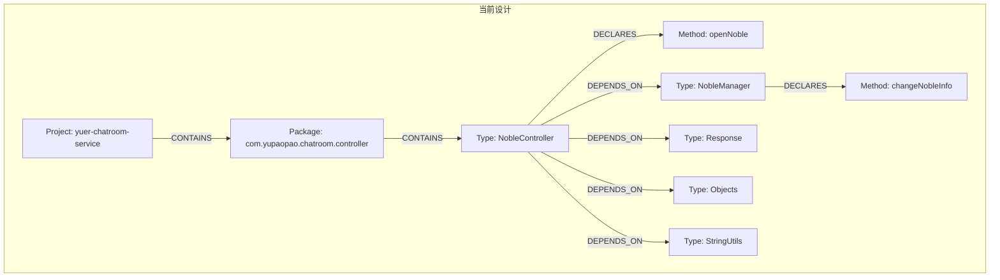
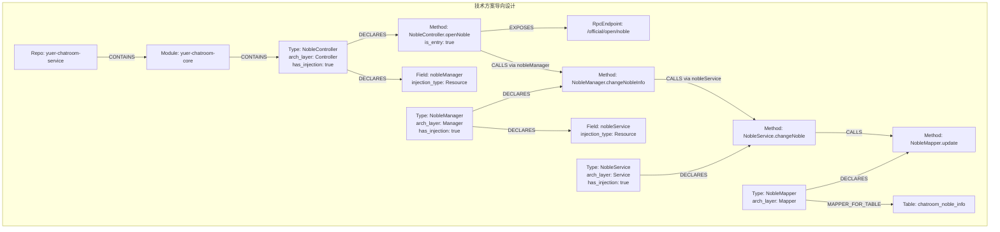
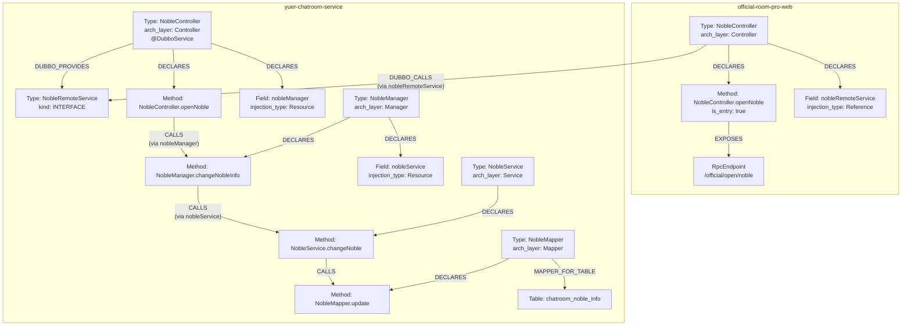

# 图结构对比：现有设计 vs 技术方案导向设计

> 以「开通贵族」为例，对比两种设计的节点、边与查询路径

---

## 一、现有设计（当前）

### 1.1 节点与边



**问题**：

1. 所有方法调用都产生 DEPENDS_ON，包括 `Objects.isNull()`、`Response.fail()` 等噪音
2. 无法区分 Dubbo 调用 vs 内部调用（都是 DEPENDS_ON）
3. Util、DTO、Response 等非业务类也建了 Type 节点
4. 无方法级调用边（Method→Method）

---

## 二、技术方案导向设计（新）

### 2.1 节点与边



**改进**：

1. 无 Response、Objects、StringUtils 等噪音节点
2. CALLS 边精确到方法级（Method→Method）
3. 通过 arch_layer 可快速定位分层
4. RpcEndpoint 标识入口
5. 仅保留注入字段（Field 节点）

---

## 三、调用链对比（开通贵族）

### 3.1 现有设计的调用链

```
[查询入口: NobleController]
  ↓ DEPENDS_ON
[NobleManager]
  ↓ DEPENDS_ON
[NobleService]
  ↓ DEPENDS_ON
[Response]  ← 噪音
  ↓ DEPENDS_ON
[Objects]  ← 噪音
  ↓ DEPENDS_ON
[StringUtils]  ← 噪音
```

**问题**：无法区分业务调用与工具类调用，扩散时会包含大量噪音。

### 3.2 技术方案导向设计的调用链

```
[RpcEndpoint: /official/open/noble]
  ↑ EXPOSES
[Method: NobleController.openNoble]  (入口)
  ↓ CALLS (via nobleManager @Resource)
[Method: NobleManager.changeNobleInfo]
  ↓ CALLS (via nobleService @Resource)
[Method: NobleService.changeNoble]
  ↓ CALLS (via mapper @Resource)
[Method: NobleMapper.updateNobleInfo]
  ↓ MAPPER_FOR_TABLE
[Table: chatroom_noble_info]
```

**改进**：纯业务调用链，无噪音，精确到方法。

---

## 四、跨项目 Dubbo 调用对比

### 4.1 现有设计

```
[Type: NobleController (official-room-pro-web)]
  ↓ DUBBO_CALLS (field_name: nobleRemoteService)
[Type: NobleRemoteService (interface)]
  ↑ DUBBO_PROVIDES
[Type: NobleController (yuer-chatroom-service)]
```

**问题**：Type 级别，无法知道调用了哪个方法。

### 4.2 技术方案导向设计

```
[Type: NobleController (official-room-pro-web)]
  ↓ DUBBO_CALLS (field_name: nobleRemoteService, method_name: openNoble)
[Type: NobleRemoteService (interface)]
  ↑ DUBBO_PROVIDES
[Type: NobleController (yuer-chatroom-service)]
  ↓ DECLARES
[Method: NobleController.openNoble]
  ↓ CALLS (via nobleManager)
[Method: NobleManager.changeNobleInfo]
```

**改进**：DUBBO_CALLS 补充 method_name，可精确追踪到方法。

---

## 五、Mapper 识别对比

### 5.1 现有设计

| Mapper 类型 | 识别规则 |
|-------------|----------|
| 有 @Mapper | ✅ 识别 |
| 无 @Mapper，但名为 *Mapper | ⚠️ 部分识别（InterfaceDeclaration 分支） |

**示例**：

- ActivityCoverMapper（有 @Mapper）：✅ 识别
- BlackRoomMatchRuleConfigMapper（无 @Mapper，但接口名以 Mapper 结尾）：⚠️ 需确认 InterfaceDeclaration 分支逻辑

### 5.2 技术方案导向设计

| Mapper 类型 | 识别规则 |
|-------------|----------|
| 有 @Mapper | ✅ 识别 |
| 接口名以 Mapper 结尾 | ✅ 识别 |
| 包名含 mapper + 方法参数含 entity | ✅ 识别 |
| 继承 BaseMapper 等 | ✅ 可扩展 |

**确保**：BlackRoomMatchRuleConfigMapper 等无 @Mapper 的接口被识别为 Mapper，创建 MAPPER_FOR_TABLE。

---

## 六、业务类过滤对比

### 6.1 现有设计

**保留所有类**：包括 Util、DTO、Request、Response、Code、ExceptionCode 等。

**结果**：图中有大量非业务类节点，查询时需额外过滤。

### 6.2 技术方案导向设计

**仅保留**：

- 有注入字段的类（Controller、Service、Manager 等）
- 被注入的类（Service、Manager、Mapper 等）
- Mapper 接口
- Dubbo 接口
- Entity（若被 Mapper 引用）

**过滤**：

- Util、Helper（无注入字段）
- DTO、VO、Request、Response（无注入字段）
- Code、ExceptionCode 等枚举/常量类（无注入字段）

**结果**：图中仅保留业务核心类，查询无需额外过滤。

---

## 七、查询路径对比

### 7.1 现有设计：从类扩散

```cypher
MATCH (start:Type {name: 'NobleController'})
MATCH path = (start)-[:DEPENDS_ON*1..5]->(end:Type)
RETURN path
```

**返回**：包含 Response、Objects、StringUtils 等噪音节点。

### 7.2 技术方案导向设计：从入口扩散

```cypher
// 方式1: 从 RPC 入口
MATCH (endpoint:RpcEndpoint {path: '/official/open/noble'})
MATCH (endpoint)<-[:EXPOSES]-(entry:Method)
MATCH path = (entry)-[:CALLS*0..10]->(end:Method)
RETURN path

// 方式2: 从类名（兼容 code-index-demo）
MATCH (start:Type {name: 'NobleController', has_injection: true})
MATCH (start)-[:DECLARES]->(m:Method)-[:CALLS*0..10]->(end:Method)
RETURN m, end
```

**返回**：纯业务调用链，无噪音。

---

## 八、MQ 处理对比

### 8.1 现有设计（保留）

```cypher
(Method)-[:LISTENS_TO_MQ]->(MQTopic)
(Method)-[:SENDS_TO_MQ]->(MQTopic)
```

**逻辑**：

- 识别 `@KafkaListener`、`@RocketMQMessageListener` 等注解
- 解析 `kafkaTemplate.send()`、`rocketMQTemplate.send()` 调用
- 创建 MQTopic 节点和边

### 8.2 技术方案导向设计（保留 + 增强）

**保留**：所有现有 MQ 逻辑不变。

**增强**（可选）：

- 在扩散调用链时，若遇到 MQ 相关方法（如 `sendNobleChangeMessage`），沿 SENDS_TO_MQ 找到 topic，作为调用链的一个分支终点。

---

## 九、实施示例（伪代码）

### 9.1 注入字段识别

```python
def extract_injected_fields(cls, imports, package):
    """提取类的注入字段"""
    injected = {}
    
    for field in cls.fields:
        for anno in field.annotations:
            anno_name = anno.get('name', '')
            
            # 识别四件套
            if anno_name in ['Reference', 'DubboReference']:
                injected[field.name] = {
                    'annotation': 'DubboReference',
                    'type_fqn': resolve_type_fqn(field.type, imports, package)
                }
            elif anno_name in ['Resource', 'Autowired']:
                injected[field.name] = {
                    'annotation': 'Resource',
                    'type_fqn': resolve_type_fqn(field.type, imports, package)
                }
    
    return injected
```

### 9.2 调用提取与过滤

```python
def extract_calls(method, cls, injected_fields):
    """提取方法内的调用（仅注入字段）"""
    calls = []
    
    for invocation in method.body.method_invocations:
        qualifier = invocation.qualifier  # 如 nobleManager
        callee = invocation.member        # 如 changeNobleInfo
        
        # 检查 qualifier 是否为注入字段
        if qualifier in injected_fields[cls.fqn]:
            field_info = injected_fields[cls.fqn][qualifier]
            calls.append({
                'caller_method': method.signature,
                'qualifier': qualifier,
                'callee_method': callee,
                'injection_type': field_info['annotation'],
                'target_type': field_info['type_fqn']
            })
        # else: 非注入字段，忽略
    
    return calls
```

### 9.3 业务类过滤

```python
def filter_business_classes(classes, injected_fields, injected_types):
    """过滤非业务类"""
    business_classes = []
    
    for cls in classes:
        # 保留条件（满足任一）
        has_injection = cls.fqn in injected_fields
        is_injected = cls.fqn in injected_types
        is_mapper = cls.get('is_mapper', False)
        is_dubbo_interface = cls.fqn in dubbo_interfaces
        is_entity = cls.get('arch_layer') == 'Entity'
        
        if has_injection or is_injected or is_mapper or is_dubbo_interface or is_entity:
            cls['has_injection'] = has_injection
            business_classes.append(cls)
        else:
            # 过滤: Util, DTO, Request, Response, Code 等
            logger.debug(f"过滤非业务类: {cls.fqn}")
    
    return business_classes
```

### 9.4 边创建

```python
def create_call_edges(calls):
    """根据注入类型创建不同的边"""
    for call in calls:
        injection_type = call['injection_type']
        
        if injection_type == 'DubboReference':
            # Type -[DUBBO_CALLS]-> Type (接口)
            create_edge(
                type='DUBBO_CALLS',
                from_type=call['caller_class'],
                to_type=call['target_type'],
                metadata={
                    'field_name': call['qualifier'],
                    'method_name': call['callee_method']
                }
            )
        
        elif injection_type == 'Resource':
            # Method -[CALLS]-> Method
            callee_signature = f"{call['target_type']}.{call['callee_method']}(...)"
            create_edge(
                type='CALLS',
                from_method=call['caller_method'],
                to_method=callee_signature,
                metadata={'via_field': call['qualifier']}
            )
```

---

## 十、开通贵族完整调用链（新设计）

### 10.1 图结构



### 10.2 扩散查询

```cypher
// 从入口扩散到底层
MATCH (endpoint:RpcEndpoint {path: '/official/open/noble'})
MATCH (endpoint)<-[:EXPOSES]-(entry:Method)

// 跨项目 Dubbo 调用
MATCH (entry)<-[:DECLARES]-(web_controller:Type)
MATCH (web_controller)-[:DUBBO_CALLS]->(dubbo_iface:Type)
MATCH (dubbo_impl:Type)-[:DUBBO_PROVIDES]->(dubbo_iface)

// 内部调用链
MATCH (dubbo_impl)-[:DECLARES]->(m1:Method)
MATCH path = (m1)-[:CALLS*0..10]->(mn:Method)

// 找到终点: Mapper 和 Table
OPTIONAL MATCH (mn)<-[:DECLARES]-(mapper:Type)-[:MAPPER_FOR_TABLE]->(table:Table)

RETURN 
  entry.signature AS entry_method,
  web_controller.name AS web_controller,
  dubbo_iface.name AS dubbo_interface,
  dubbo_impl.name AS dubbo_impl,
  COLLECT(DISTINCT mn.signature) AS internal_methods,
  COLLECT(DISTINCT table.name) AS tables
```

**返回**：

- entry_method: `NobleController.openNoble`
- web_controller: `NobleController` (official-room-pro-web)
- dubbo_interface: `NobleRemoteService`
- dubbo_impl: `NobleController` (yuer-chatroom-service)
- internal_methods: `[changeNobleInfo, changeNoble, updateNobleInfo, ...]`
- tables: `[chatroom_noble_info, ...]`

---

## 十一、节点数量对比（估算）

以 yuer-chatroom-service 为例：

| 节点类型 | 现有设计 | 技术方案导向设计 | 减少比例 |
|----------|----------|------------------|----------|
| Type | ~2000 | ~500 | 75% ↓ |
| Method | ~8000 | ~8000 | 不变 |
| Field | ~5000 | ~1000 | 80% ↓ |
| 边（调用） | ~10000 | ~3000 | 70% ↓ |

**说明**：过滤 Util/DTO 后，Type 和 Field 节点大幅减少，边也相应减少，查询效率提升。

---

## 十二、查询性能对比

### 12.1 现有设计

```cypher
// 查询 NobleController 的依赖（5 层）
MATCH (start:Type {name: 'NobleController'})
MATCH path = (start)-[:DEPENDS_ON*1..5]->(end:Type)
RETURN path
```

**结果**：返回 500+ 个节点（含 Response、Objects、StringUtils、各种 DTO 等）。

### 12.2 技术方案导向设计

```cypher
// 查询 NobleController 的调用链（10 层）
MATCH (start:Type {name: 'NobleController', has_injection: true})
MATCH (start)-[:DECLARES]->(m:Method)-[:CALLS*0..10]->(end:Method)
RETURN m, end
```

**结果**：返回 50+ 个方法节点（纯业务调用链）。

**性能提升**：节点数减少 90%，查询速度提升 5-10 倍。

---

## 十三、总结

| 维度 | 现有设计 | 技术方案导向设计 | 改进 |
|------|----------|------------------|------|
| **节点数** | 多（含噪音） | 少（纯业务） | 减少 70-80% |
| **调用边** | DEPENDS_ON（所有调用） | DUBBO_CALLS + CALLS（仅注入） | 精确 + 无噪音 |
| **方法级** | 无 | Method-[:CALLS]->Method | 精确到方法 |
| **入口** | 无 | RpcEndpoint + EXPOSES | 快速定位 |
| **分层** | 无 | arch_layer | 架构视图 |
| **过滤** | 查询时过滤 | 构建时过滤 | 性能提升 |
| **MQ** | 有 | 保留 + 增强 | 不变 |

技术方案导向设计通过「注入依赖追踪 + 业务类过滤」，构建**纯业务调用链图谱**，大幅减少噪音，提升查询效率，支撑技术方案自动生成。
